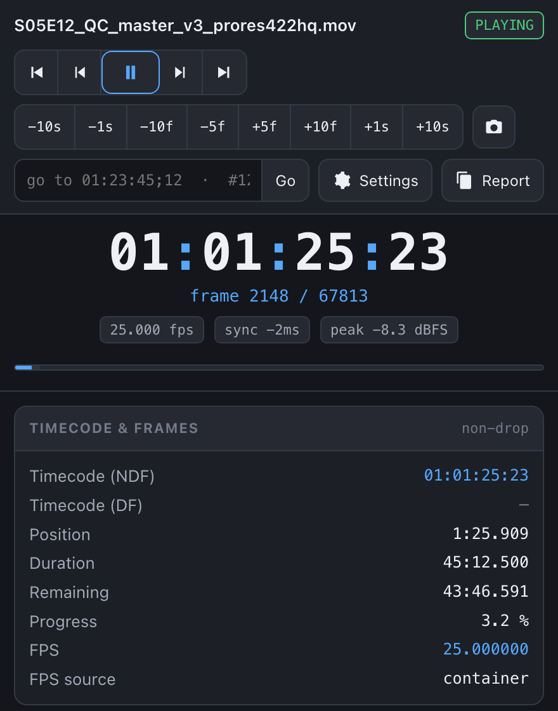
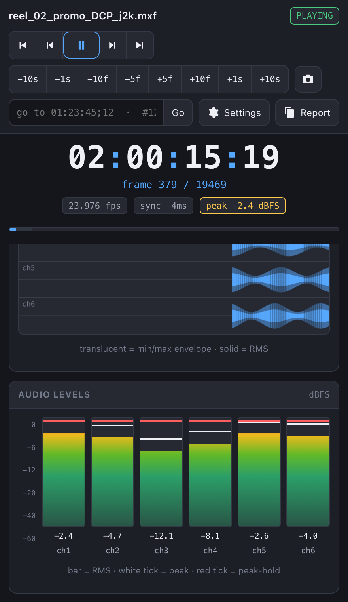

# IINfo

A real-time video-QC inspector plugin for [IINA](https://iina.io).

**IINfo** is a floating window that reports exactly what the player is decoding and
rendering *right now*, frame by frame — timecode, per-frame metadata, signal/colour
parameters, A/V-sync and dropped-frame counters, a scrolling audio waveform, and
level + EBU R128 loudness meters.

<p align="center">
  
  
  
</p>

## What it shows

A pinned **essentials strip** at the top always shows the critical data — big SMPTE
timecode, frame number, fps, A/V-sync and peak-level chips — no matter which panels
are open or how far you've scrolled.

Below it, every section is an independent toggle (**Panels ▾** button):

| Panel | Contents |
|---|---|
| **Timecode & Frames** | SMPTE timecode NDF + DF, current/total frame number, container fps + source, position/duration/remaining, progress % |
| **Frame Metadata** | Picture type (I/P/B) with colour coding, keyframe flag, progressive/interlaced + field order (TFF/BFF), repeat flag, GOP / stream SMPTE timecode, plus any extra keys mpv exposes |
| **Video Signal / Color** | Coded vs display resolution, DAR / PAR, pixel format, chroma subsampling + bit depth, chroma siting, colour range (TV/PC), matrix, primaries, transfer (HDR-highlighted), signal peak, rotation, 3D/alpha |
| **Codec & Bitrate** | Container, file size, video codec + decoder, hardware-decode path, live video bitrate (with sparkline), audio codec + bitrate |
| **A/V Sync & Dropped Frames** | A/V sync offset in ms (green/amber/red) with history sparkline, decoder-dropped and output-dropped frame counters, mistimed / delayed frames, display refresh vs filtered fps, demux cache |
| **Audio Waveform** | Live scrolling min/max envelope + RMS band, per channel (or summed), built from `astats` `Min/Max/RMS_level`. Clipping columns turn red |
| **Audio Levels** | Per-channel RMS bar meters with peak tick + peak-hold, dBFS readout, clip warning |
| **EBU R128 Loudness** | Momentary / Short-term / Integrated LUFS, Loudness Range, True Peak (dBTP), target reference. Momentary sparkline |
| **Audio Format** | Sample rate, channel count + layout, sample format, codec, track title / language |

The three audio panels share one labelled lavfi filter
(`asetnsamples` → `astats` → `ebur128`) that is inserted only while at least one of
them is enabled and removed when they're all off or the window closes. It is rebuilt
on every file change so `ebur128`'s integrated loudness never carries over between
clips.

### Display settings (Panels ▾)

- **Theme** — Auto (follows macOS), Dark, Black (OLED), Light, High contrast
- **Readout font** — the monospace face for all numeric readouts (System mono, SF Mono,
  Menlo, Monaco, PT Mono, Andale Mono, Courier; JetBrains / IBM Plex Mono if installed)
- **Text size** — XS … XXL
- **Sum waveform channels** — one combined lane instead of one per channel

All of these, plus which panels are open, persist across sessions via `iina.preferences`.

### Transport controls (top bar)
- `⏮` / `⏭` — jump to start / end
- `◀▐` / `▐▶` — step one frame back / forward (also `⌥⇧←` / `⌥⇧→`)
- `⏯` — play / pause (primary button)
- `−10s −1s +1s +10s` — exact seek nudges
- `◉` — exact-frame screenshot without subtitles/OSD (`⌥⇧S`)
- **jump field** — type `01:23:45;12`, `01:23:45.500`, `#12345` (frame), or `83.4` (seconds) + Enter
- **Copy report** — dumps a plain-text snapshot of every field for pasting into notes/tickets

## Install

Requires IINA 1.4.0 or newer.

### From a release (recommended)

Download `IINfo.iinaplgz` from the [latest release](https://github.com/ProductionVideo/IINfo/releases/latest)
and double-click it, or drag it onto IINA's Settings ▸ Plugins ▸ *install* sheet.

### From GitHub, inside IINA

IINA Settings ▸ Plugins ▸ **+** ▸ paste `https://github.com/ProductionVideo/IINfo`.

### For development

```sh
ln -s /Applications/IINA.app/Contents/MacOS/iina-plugin /usr/local/bin/iina-plugin   # once
iina-plugin link /path/to/IINfo
```

Enable **Developer Mode** in IINA Settings ▸ Plugins and restart IINA. Package with
`iina-plugin pack /path/to/IINfo` (or `zip -r IINfo.iinaplgz Info.json main.js ui README.md`
if your IINA build's `pack` is broken).

Then: open a video ▸ **Plugin** menu ▸ **Toggle IINfo Inspector** (`⌥⇧I`).

## How it works

- `main.js` runs in each player window. A ~30 Hz poll loop from the webview asks
  the plugin for one data frame; the plugin reads ~50 mpv properties
  (`video-params`, `audio-params`, `video-frame-info`, `avsync`,
  `*-frame-drop-count`, `af-metadata/iinfo`, …) and posts a single JSON payload.
- `ui/inspector.html` is a self-contained web view (no build step). Panels are
  built once and updated in place — never re-rendered — so scrolling is stable.
  `requestAnimationFrame` eases the meters and redraws the canvases (waveform,
  sparklines); small ring buffers hold the history.
- Audio analysis inserts a labelled filter at runtime:
  `af add @iinfo:lavfi=[asetnsamples=n=1024:p=0,astats=metadata=1:reset=1,ebur128=metadata=1:peak=true]`.
  It is removed when all three audio panels are off and when the window closes, and
  fully rebuilt on `iina.file-loaded`.
- Every data frame carries a `gen` counter that the plugin bumps on `iina.file-loaded`;
  the web view drops its waveform / meter / sparkline history when it changes, so
  nothing freezes on the previous clip's last frame.
- Panel visibility and display settings are persisted through `iina.preferences`
  (one JSON blob under the `config` key).

## Permissions

`show-osd` only (screenshot / frame-step confirmations). No file-system or
network access.

## Notes & limitations

- Metering values update only while audio is actually playing (filters produce no
  metadata while paused).
- `container-fps` is used for timecode; if absent, `estimated-vf-fps` is the
  fallback and the timecode is approximate.
- Drop-frame detection assumes 29.97 / 59.94 = drop, everything else = non-drop.
- Some `video-frame-info` sub-fields depend on the mpv build; unknown keys are
  shown raw rather than hidden.

## License

MIT — see [LICENSE](LICENSE).
