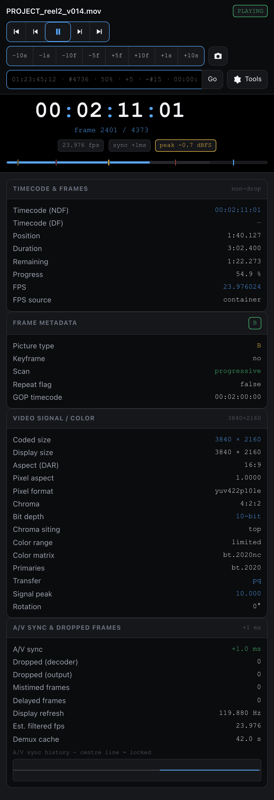
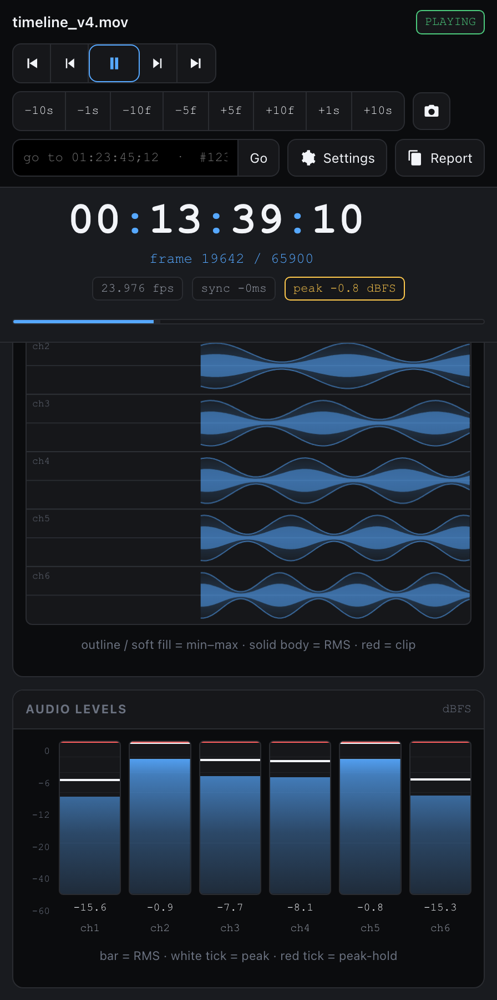
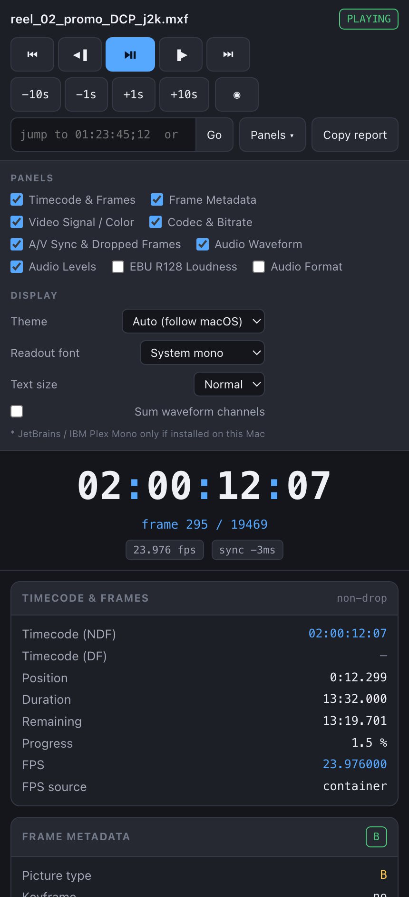

# IINfo

A real-time video-QC inspector plugin for [IINA](https://iina.io) — a floating,
theme-able window that reports exactly what the player is decoding and rendering
*right now*, frame by frame.

   
  
  

## What it shows

A pinned **essentials strip** always shows the critical data — big SMPTE timecode,
frame number, fps, A/V-sync and peak level — whatever else is on screen. Hover it
for **copy** / **go** chips (`c` copies the timecode, `Shift+C` the frame number).
Below it, each panel is an independent toggle (**Settings ▾**), and your choices
persist:

| Panel | Contents |
|---|---|
| **Timecode & Frames** | SMPTE timecode (NDF + drop-frame), current / total frame, container fps + source, position / duration / remaining, progress |
| **Frame Metadata** | Picture type (I/P/B), keyframe, progressive / interlaced + field order, repeat flag, GOP / stream SMPTE TC |
| **Video Signal / Color** | Coded vs display size, DAR / PAR, pixel format, chroma + bit depth, chroma siting, range, matrix, primaries, transfer, signal peak, rotation, 3D / alpha |
| **Codec & Bitrate** | Container, file size, codec + decoder, hardware-decode path, live video bitrate sparkline, audio codec + bitrate |
| **A/V Sync & Dropped Frames** | A/V-sync offset (ms) + history, decoder / output drop counts, mistimed / delayed frames, display vs filtered fps, demux cache |
| **Audio Waveform** | Live scrolling min–max + RMS curves, per channel or summed. Themed accent; red only where a sample clips |
| **Audio Levels** | Per-channel meters — RMS on a theme-accent gradient that turns amber/red only near clip, plus peak and peak-hold ticks |
| **EBU R128 Loudness** | Momentary / Short-term / Integrated LUFS, LRA, True Peak, target reference, momentary sparkline |
| **Audio Format** | Sample rate, channels + layout, sample format, codec, track title / language |

**Controls:** skip to start / end · frame step · stateful play/pause · jump bar
(`−10s −1s −10f −5f · +5f +10f +1s +10s`) · exact-frame screenshot · click/drag
scrub bar · **Report** (plain-text dump of every field).

**Go field** — absolute: a timecode (`01:23:45;12`), `#4736` (frame), `50%`, `90s`.
Relative to the current point, repeatable on each Enter: `+5` / `-5` (seconds),
`+#15` / `-#15` (frames), `+2:30`, `+10%`. Or *base ± delta*: `00:00:05;17 + 2`.
Every jump snaps to the nearest frame.

**Keyboard** (while the inspector window is focused — the keys are relayed to IINA):
`Space`/`k` play·pause · `←`/`→` seek ∓5 s · `j`/`l` ∓10 s · `,`/`.` frame step ·
`Shift`+`←`/`→` frame step · `m` mute · `[`/`]` speed · `Home`/`End`.
Menu bindings: `⌥⇧I` toggle · `⌥⇧←/→` frame step · `⌥⇧S` screenshot.

**Display:** Black (OLED, default) / Dark / Graphite / Midnight Blue / Green Phosphor
/ Amber CRT / High contrast / Light / Auto · readout font (Courier default + a dozen
mono faces) · text size XS–XXL.

## Install

Requires IINA 1.4.0+.

- **Release:** download `IINfo.iinaplgz` from the
  [latest release](https://github.com/ProductionVideo/IINfo/releases/latest) and open it.
- **From GitHub:** IINA ▸ Settings ▸ Plugins ▸ **+** ▸ `https://github.com/ProductionVideo/IINfo`.
- **Development:** `iina-plugin link /path/to/IINfo`, enable Developer Mode, restart IINA.

Then open a video ▸ **Plugin** menu ▸ **Toggle IINfo Inspector** (`⌥⇧I`).

## How it works

`main.js` runs per player window; a ~30 Hz poll from the web view pulls one JSON
payload of ~40 mpv properties. `ui/inspector.{html,css,js}` is a self-contained web
view (no build step) — panels are built once and updated in place, `requestAnimationFrame`
drives the meters and canvases.

Audio analysis uses one labelled lavfi filter,
`@iinfo:lavfi=[asetnsamples=n=1024:p=0,astats=metadata=1:reset=1,ebur128=metadata=1:peak=true]`,
whose entire lifecycle runs from the poll handler — installed, torn down, reinstalled
per clip, retried if `af add` was too early — so a close→open or track switch always
recovers on the next poll. Metering data is gated behind a `meter.fresh` check
(non-empty, settled, and diverged from an install snapshot) so the previous clip's
`af-metadata` can never drive the UI.

Panel visibility and display settings persist via `iina.preferences` (`set` + `sync`).
Only permission used is `show-osd`.

## Limitations

- Meters/waveform update only while audio is playing.
- Timecode uses `container-fps`, falling back to an estimate; drop-frame is assumed
  for the 29.97 / 59.94 family only.
- `video-frame-info` fields vary by mpv build.

## License

MIT — see [LICENSE](LICENSE). Changelog in [CHANGELOG.md](CHANGELOG.md).
